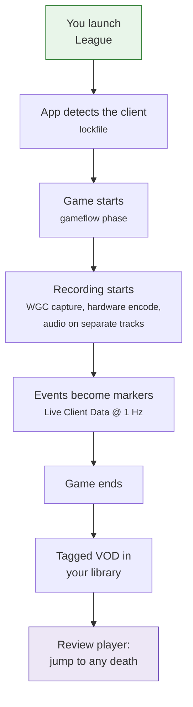
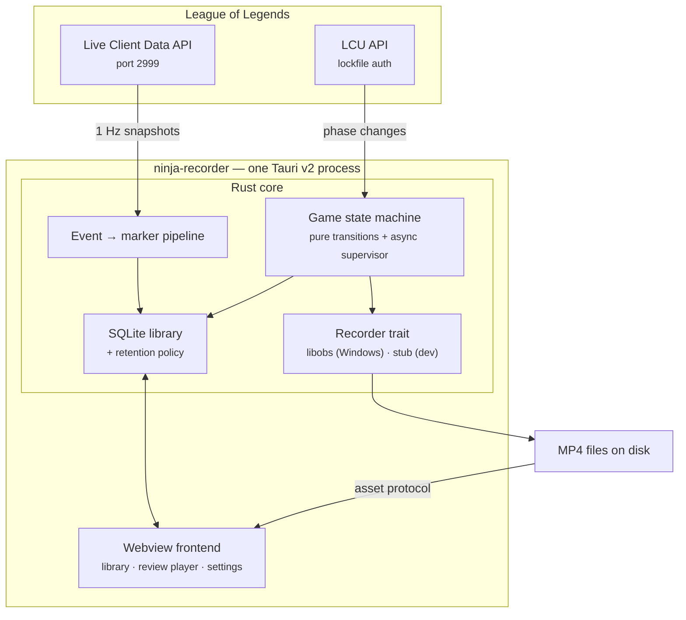

# ninja-recorder (deprecated)

> [!IMPORTANT]
> **This repository is deprecated and archived. Development has moved to
> [NinjaGoldfinch/ninja-recorder](https://github.com/NinjaGoldfinch/ninja-recorder).**
>
> Nothing here is maintained any more. Issues, pull requests and releases are
> frozen and the code is kept for history only. File issues, and get builds,
> at the new repository.

A lightweight League of Legends VOD recorder for Windows. It records your
games automatically, tags the timeline with in-game events — kills, deaths,
dragons, barons, turrets — and gives you a review player built for improving,
not for editing.

No OBS to install. No scenes to configure. No injection into the game, ever.

> **Working, on Windows, against real games.**
> [Releases](../../releases) · [what has been verified, and what has
> not](docs/windows-verification.md)

---

## What it does



You do not press a button anywhere in that chain.

## Why

- **Zero-config recording.** The League Client API tells the app when a game
  starts. That's the whole trigger. Turn on start-on-login and it comes up in
  the tray with your PC, so there is nothing to remember to launch.
- **Event-tagged VODs.** Every kill, death, dragon, baron, herald and turret
  becomes a marker on the timeline. Jump straight to your deaths. Clip the
  teamfight. A per-second advantage curve sits under the markers.
- **Separate audio tracks.** Pick what to capture — game only, game plus your
  mic, game plus mic plus Discord, or the whole desktop. Track 0 is always the
  combined mix, so the VOD just plays; the tracks after it are isolated stems,
  so you can still pull your mic out of a game you recorded months ago. Your
  microphone is only ever recorded on a preset that names it.
- **Lightweight.** A Tauri shell (~10 MB, uses the OS webview) plus embedded
  libobs. No Electron, no bundled Chromium. Idle RAM and install size are
  tracked targets, not vibes.
- **Vanguard-safe by design.** Capture is Windows Graphics Capture only. No
  process injection, no API hooks, no memory reading. This is not a setting.
- **It won't eat your SSD.** 1080p60 at 8 Mbps is ~3.5 GB/hour. Retention
  ships on by default (50 GiB / 30 days), with pinning for the games you want
  to keep and a preview of what a tightened policy would delete before you
  save it.

## Install

**Windows only.** New builds are published at
[NinjaGoldfinch/ninja-recorder](https://github.com/NinjaGoldfinch/ninja-recorder/releases).
The [releases here](../../releases) are frozen at the point this repository
was archived.

That is a constraint, not an omission: capture is built on
Windows.Graphics.Capture, which is the only way to record a
Vanguard-protected game without injecting into it. There is no build for
another platform, and a stub one would not be able to record.

The installer is unsigned, so SmartScreen warns on first run.

After the first install it **updates itself**: the app checks on launch and
every six hours, puts a dot on the settings button, and installs when you
click it in Settings → About — never on its own, and never while a game is
being recorded. See [DEVELOPMENT.md §14](DEVELOPMENT.md#14-updates) for why it
asks rather than just doing it.

## Architecture in one picture



- **Capture:** [libobs](https://github.com/obsproject/obs-studio) embedded as
  a library — not OBS-the-app, nothing for the user to install — driven
  programmatically. WGC window capture plus hardware encode (NVENC/AMF/QSV).
- **Game detection:** the LCU's gameflow phase, over its WebSocket where
  available, polling as a fallback.
- **Events:** the Live Client Data API at `https://127.0.0.1:2999`, polled at
  1 Hz during games.
- **Storage:** MP4s on disk are the source of truth; SQLite holds match
  metadata, markers and the advantage samples.

Full detail, with the runtime sequence and every diagram:
**[docs/](docs/)**.

## Documentation

| Document | What it covers |
|---|---|
| [docs/architecture.md](docs/architecture.md) | Components, module map, the `Recorder` trait boundary |
| [docs/recording-pipeline.md](docs/recording-pipeline.md) | The core workflow end to end: state machine, events → markers, finalize |
| [docs/data-model.md](docs/data-model.md) | Schema, migrations, reconciliation, retention |
| [docs/frontend.md](docs/frontend.md) | Module ownership, views, IPC surface, theming |
| [docs/dev-portal.md](docs/dev-portal.md) | Driving the backend without League running |
| [docs/ci-and-releases.md](docs/ci-and-releases.md) | CI job graph, versioning, releases |
| [docs/windows-verification.md](docs/windows-verification.md) | What was checked on real hardware, and what is still open |
| [docs/product-design.md](docs/product-design.md) | The product, the decisions behind it, and how it was actually built |
| [DEVELOPMENT.md](DEVELOPMENT.md) | The *why*: constraints, decisions, alternatives rejected, risks |

## Development

```bash
npm install
npm run tauri:dev
```

Prerequisites: Rust stable and Node.js.

**`tauri:dev`, not `tauri dev`** — the colon matters. It passes
`--features devtools`, which compiles in the dev portal: a second window that
seeds the library, drives the state machine without League running, dry-runs
the retention policy and runs raw SQL. Most of the backend can only be
exercised through it. See [docs/dev-portal.md](docs/dev-portal.md).

**The Rust project lives at `src-tauri/`, not the repo root.** Bare `cargo`
commands must be run from there. These four are exactly what CI gates on:

```bash
cd src-tauri && cargo test
cd src-tauri && cargo test --features devtools
cd src-tauri && cargo clippy --no-deps -- -D warnings
cd src-tauri && cargo clippy --features devtools --no-deps -- -D warnings
```

Note the absent `--all-targets`: CI does not pass it, so clippy never compiles
the test targets, and a method only the tests call counts as **dead code** that
`-D warnings` fails the build over. Adding `--all-targets` locally compiles the
tests, marks that method used, and hides the failure until CI.

`npm run tauri:dev` handles that for you from the repo root.

### Where work happens

| Layer | Where | Loop |
|---|---|---|
| LCU, Live Client Data, state machine | Dev box, against captured fixtures | seconds |
| VOD library, review UI | Dev box, stub recorder + fixture MP4s | seconds |
| Capture backend | Windows box, `cargo run` | seconds |
| Full integration + Vanguard check | Windows, CI-built installer | occasional |

Installers are produced by CI, never built locally and never cross-compiled —
libobs linking, DLL bundling and installer generation from anywhere but
Windows is a fight with no payoff.

## Non-negotiable constraints

1. **No injection.** OBS "Game Capture"–style hooking is permanently off the
   table. Riot Vanguard is a kernel anti-cheat and DLL injection is exactly
   what it exists to stop. WGC and display capture only.
2. **Official APIs only.** LCU and Live Client Data. No memory reading, no
   packet sniffing.
3. **Lightweight is a feature.** Idle RAM and install size are measured
   against targets, not asserted.

Anything that would violate these is not a trade-off to weigh — it is out of
scope. The reasoning is in
[DEVELOPMENT.md §1](DEVELOPMENT.md#1-hard-constraints).

## Not built

- **YouTube upload.** Design notes exist ([DEVELOPMENT.md §7](DEVELOPMENT.md#7-youtube-upload-designed-not-built)),
  including the quota reality that makes auto-upload a non-starter.
- **`.rofl` replay download.** Also designed, not implemented
  ([DEVELOPMENT.md §8](DEVELOPMENT.md#8-rofl-replays-designed-not-built)).

## License

GPL-2.0-only. The capture backend embeds
[libobs](https://github.com/obsproject/obs-studio) (GPLv2), which obligates
the whole distributed binary. That is inherited from the dependency, not a
preference.
